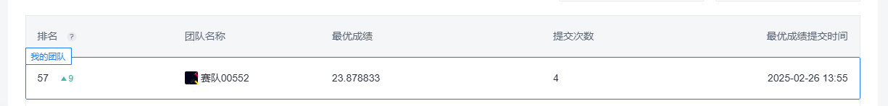

## 第三届电磁大数据非凡挑战赛任务三代码

本人第一次打这种电磁数据的比赛，较短的时间内只尝试了任务三，即预测码元序列的任务，代码较为简陋，希望与大家共同学习进步。

## 数据处理

1. 仅仅将原始IQ数据列转为numpy格式，进入网络结构前做了标准化

## 尝试模型

1. 使用的模型为IQSeqCompressor，自定义的长序列预测模型
2. 长时间序列预测SOTA，[TimeXer]([[2402.19072\] TimeXer: Empowering Transformers for Time Series Forecasting with Exogenous Variables](https://arxiv.org/abs/2402.19072))
3. 自定义模型较SOTA低一个点

